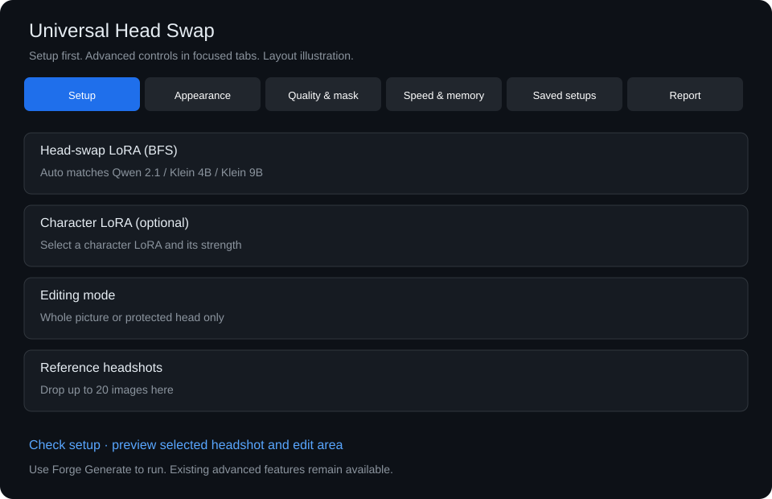
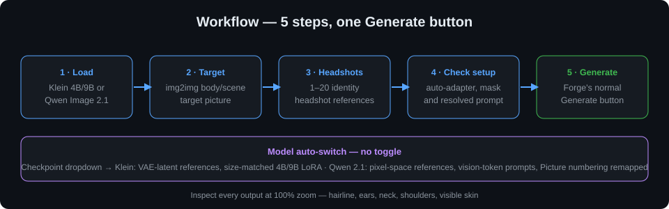

# Universal Head Swap for Forge Neo

**BFS head swapping in Forge's familiar workflow. One extension for FLUX.2 Klein 4B/9B and Qwen Image Edit 2.1 — the loaded checkpoint decides the mode.**

[Installation](#beginner-installation) · [Model files](#model-files) · [Step-by-step usage](#step-by-step-usage) · [UI tour](#ui-tour) · [Latest update](#latest-update) · [Testing status](#features-and-testing-status)

## Latest update

- **Fixed dedicated Qwen 2.1 routing:** Head Swap now supplies its references, prompts, BFS and character LoRAs to the Project Invisible engine.
- **Automatic BFS selection:** follows preset/checkpoint changes and finds the preferred Qwen or Klein adapter in subfolders.
- **Protected-head repair:** complete-scene conditioning, RGBA handling and masked compositing preserve the surrounding picture.
- **Turbo and saving:** tested Qwen BFS + character + Viggle Turbo on INT8 ConvRot; the companion engine verifies saved files and reports their paths.
- **Optional face-match checks:** bounded CPU checks appear in the generation report; review likeness visually too.

**130 Head Swap tests passed.** The companion Qwen suite passed 132 tests. Real GPU testing used 13 headshots on an RTX 5090; other quantizations and a real Klein run remain unverified.

**Qwen users must update both extensions and restart Forge.** An older Project Invisible Qwen engine bypasses Head Swap. See [the companion integration requirement](docs/QWEN21_INTEGRATION.md). Details: [change history](CHANGELOG.md).

## The idea

Use Forge's normal img2img tab, prompt, seed and **Generate** button.
Special controls stay inside a compact, collapsed **Universal Head Swap** panel.
The original picture is the body/scene reference; the selected headshot is the identity reference.
This is an independent community extension, not an official product. Inspect every output at 100% zoom.

## Features and testing status

- **FLUX.2 Klein 4B/9B:** inherited from the validated v6 codebase; reference latents, size-matched BFS adapters.
- **Qwen 2.1:** dedicated Project Invisible bridge, target/reference ordering and protected editing verified with INT8 ConvRot, BFS, a character LoRA and Viggle Turbo. The older native Qwen route has separate reference handling.
- **Organized controls:** six focused tabs, with both LoRA selectors visible in Setup.
- **Memory:** device-aware probing (never assumes GPU 0), bounded reference budgets, one OOM retry, 256 MiB encode cache.
- **Quantization:** all modern formats through Forge's own loaders; LoRAs stay on the runtime side path, never merged into quantized weights.
- **No Forge core edits:** delete the extension folder and Forge is 100% stock.

Automated tests do not prove every GPU, model file or Forge version works.
AMD/ROCm is supported in code but **not hardware-validated here**. DirectML/Vulkan are not implemented.
No promise is made for every VRAM size.

## Beginner installation

1. Stop Forge completely.
2. Choose **Code → Download ZIP** on this repository.
3. Extract the folder and place it inside `sd-webui-forge-classic/extensions/`.
4. Avoid double nesting. The correct path ends with:
   `extensions/universal-head-swap/scripts/klein_face_reference.py`.
5. Keep only one copy of the old `klein-head-swap` extension — disable or remove it first.
6. Start Forge normally. The extension installs no shared packages.
7. Refresh your browser with **Ctrl+F5** after updates.

## Model files

**Weights are not included.** Use your own downloaded checkpoints and LoRAs in Forge's normal folders.

| Component | Forge folder |
|---|---|
| FLUX.2 Klein 4B or 9B checkpoint, **or** Qwen Image Edit 2.1 checkpoint | `models/Stable-diffusion` |
| Matching BFS face/head-swap LoRA for the loaded family | `models/Lora` |
| Optional character LoRA (same family as the checkpoint) | `models/Lora` |

A Klein BFS LoRA is **not** interchangeable with Qwen — the extension enforces the family match and explains mismatches.

## UI tour

Everything lives inside Forge's normal img2img view. The extension adds a single collapsed **Universal Head Swap** accordion:

Inside the panel:

- **Setup** — visible head-swap BFS and optional character LoRA selectors, strengths, trigger words, headshots, editing mode and reference selection.
- **Appearance** — cleanup, hairstyle, expression and prompt controls.
- **Quality & mask** — proportions, detail, masks, finishing and optional enhancements.
- **Speed & memory** — reference budgets and encoding reuse.
- **Saved setups** — save, load and delete settings.
- **Report** — resolved prompt and generation diagnostics.

Leave Auto enabled for matching BFS selection. Disable it to choose a head-swap LoRA manually. Choose the character LoRA separately in Setup.

## Step-by-step usage

1. **Load** — select a Klein 4B/9B or Qwen Image Edit 2.1 checkpoint and its matching BFS LoRA.
2. **Target** — open **img2img** and upload the body/scene picture.
3. **Headshots** — enable **Universal Head Swap** and upload 1–20 sharp identity headshots. Prefer similar pose and lighting.
4. **Check setup** — one click shows the selected reference, edit area and fully resolved prompt before any generation.
5. **Generate** — press Forge's normal **Generate** button, then inspect **Show last generation report** and the output at 100% zoom.

Defaults just work: adapter on **Auto (match model)**, denoising at the BFS start value (1.0), fixed seed.

## First head swap

1. Select the checkpoint in Forge's normal dropdown.
2. Open **img2img**, upload the target, enable the accordion, add headshots.
3. Click **Check setup** and read the setup status.
4. Press **Generate**.
5. Check hair edges, forehead, ears, neck, shoulders and all visible skin at 100%.

## Reports and troubleshooting

- **Show last generation report** lists the selected reference slot, resolved prompt, encode counts and quality measurements.
- **Protected head edit** dedicates the sampling canvas to the head region and composites it into the untouched original; upload an optional mask inside the extension.
- **Keep original canvas** returns the original dimensions and aspect ratio.
- Stopping during reference preparation retains completed outputs and restores owned state.
- Reference encoding retries once at a lower resolution after an out-of-memory error.

Open a GitHub issue with Forge version/commit, operating system, GPU/VRAM/RAM,
checkpoint and LoRA filenames, image size, editing mode, reproduction steps and
the complete relevant traceback.

**Remove private paths, prompts, tokens and personal images before posting.**

## Isolation and Forge updates

Extension code stays in its own folder and hooks only `process_images_inner`
through a scoped, removable bridge. It does not rewrite Forge core files,
install shared dependencies or modify other extensions.

**Future compatibility cannot be guaranteed.** Keep a known-working backup
outside Forge before updating.

## License and credits

Extension code: [MIT License](LICENSE), based on [Adeliox's Klein Head Swap](https://github.com/Adeliox/klein-head-swap) and the owner's Enhanced v5.4 customizations. It uses [Alissonerdx's BFS workflow](https://huggingface.co/Alissonerdx/BFS-Best-Face-Swap), [Black Forest Labs' Klein models](https://huggingface.co/black-forest-labs/FLUX.2-klein-9B) and [Forge Neo reference inference](https://github.com/Haoming02/sd-webui-forge-classic/wiki/Inference-References). Model, LoRA and detector weights keep their own upstream licenses; this repository's license does not relicense them. Fine-grid cleanup is adapted from Apache-2.0 ComfyUI-DeGrid; see [license](docs/DEGRID_LICENSE.txt) and [source](docs/FINE_GRID.md).

## Special thanks

Special thanks to:

- [r/sdforall](https://www.reddit.com/r/sdforall/) — community, support and inspiration
- [r/SECourses](https://www.reddit.com/r/SECourses/) — tutorials, guidance and community support
- [r/malcolmrey](https://www.reddit.com/r/malcolmrey/) — feedback and encouragement
- [Forge Neo (sd-webui-forge-classic, neo branch) by Haoming02](https://github.com/Haoming02/sd-webui-forge-classic/tree/neo) — the foundation this extension runs on, now with official Klein and Qwen 2.1 support
- [Adeliox](https://github.com/Adeliox/klein-head-swap) — original Klein Head Swap
- [Alissonerdx](https://huggingface.co/Alissonerdx/BFS-Best-Face-Swap) — BFS (Best Face Swap) workflow and LoRAs
- Project Invisible extensions — memory policy, GPU compatibility and extension philosophy

Thank you to the wider Forge, Diffusers, Qwen, DeGrid and open-source communities.

## September 26, 2026 runtime fixes

- Qwen references retain their original colors and stay in CPU memory until Forge needs them.
- Automatic matching checks the loaded architecture, including Klein 4B/9B, before stale preset flags. Keep the adapter dropdown on Auto; matching runs after Forge loads the selected checkpoint.
- Text-only Qwen is rejected: an Image Edit checkpoint and Forge edit mode are required.
- Reinstalling the generation bridge returns the existing wrapper correctly.
- Existing advanced controls and Forge-managed model offloading remain in place. Quantization support follows the installed Forge loader; every quantization has not been tested.
- CPU checks alone do not establish visual quality. The later Qwen 2.1 GPU test is described below; Klein and other quantizations still need validation.

## Dedicated Qwen 2.1 integration repair

The Project Invisible Qwen 2.1 engine bypasses Forge's standard generation callbacks. Head Swap now has an explicit bridge into that engine, so its references, prompts, BFS adapter, character adapter, finishing controls, protected mask and seed lock are actually used.

- Automatic adapter selection follows preset/checkpoint changes. It prefers `bfs_head_v1_qwen_2.1` for Qwen and `bfs_head_v1_flux-klein_9b_step3500_rank130` for Klein 9B, including adapters discovered in subfolders. Turn off automatic selection to use a custom adapter.
- Up to 20 headshots form the selection pool; each output sends its target and selected headshot to Qwen. Best-match, manual-slot and rotation controls remain available. This avoids encoding all 13 headshots for every output.
- Qwen protected-head mode conditions on the complete scene and composites only the chosen head region. It handles RGBA output and preserves original output dimensions. Native inpaint masks must be cleared; use the extension's protected mask control.
- Qwen BFS, character and the installed Viggle v0.2.1 Turbo adapter were tested together with INT8 ConvRot on an RTX 5090. Turbo keeps CFG 1; its negative prompt is inactive. Klein turbo prompt tags also keep CFG 1. Quantization remains owned by each engine; other quantizations and a real Klein generation were not GPU-validated in this repair.
- Saving now resolves an output-folder fallback, honors batch folder/name overrides, checks the written file and reports its path. Explicitly disabled saving remains disabled and is reported.
- Optional CPU identity checks are now connected to completed images and shown in the existing generation report. They are advisory; a passing score does not guarantee likeness. The real protected-head test passed the selected/median identity thresholds and face-height/center check; width/reference-consistency warnings still require visual review.

Restart Forge completely after the current batch finishes to load both updated extensions. A browser refresh alone does not load Python changes.

### Qwen quality starting point

For likeness checks, start with 20 steps, CFG 3 and Turbo off in Qwen controls, BFS strength 1.0, protected-head mode and no random appearance changes. Main sampling settings are separate from saved Head Swap setups. The dedicated Qwen engine uses Euler; Forge sampler selections do not currently enable Res Multistep/Beta there. See VALIDATION.md for measured results and limits.
